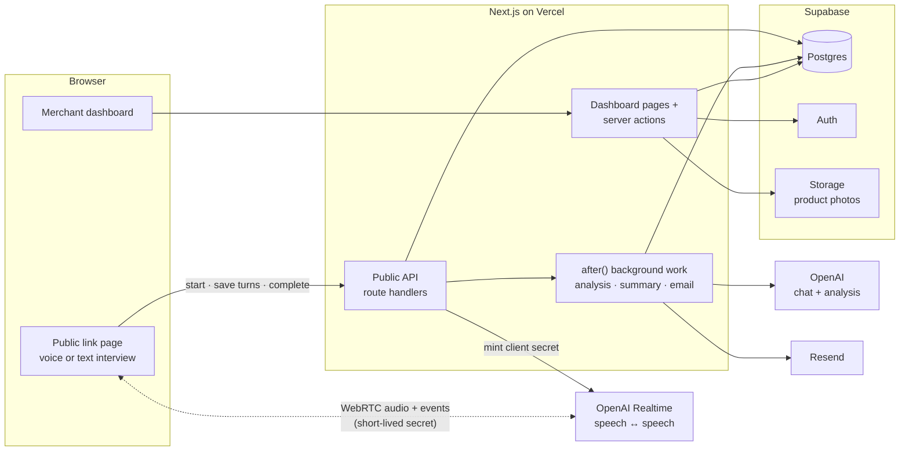
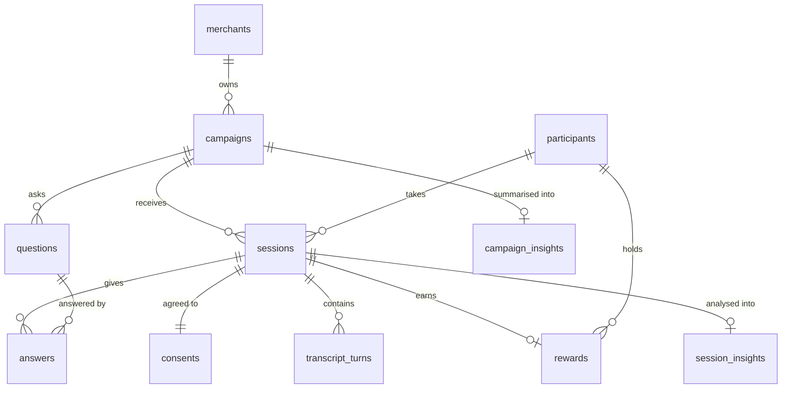

# DAP Link

One shareable link. A one-minute AI interview. The customer gets a discount code; the merchant gets structured customer intelligence.

A merchant creates a link for a product, picks a few questions and a reward, and shares it. A follower opens it on their phone, talks (or types) with EDNA, the AI interviewer, for about a minute, enters their email and gets a discount code. Every interview is transcribed, analysed and rolled up into a dashboard.

| | |
|---|---|
| Live product | https://dap-link.vercel.app |
| Example DAP Link | https://dap-link.vercel.app/everyday-hoodie |
| Test merchant login | `demo@example.com` / `DapLink-Demo-2026` at `/login` |
| Your own account | `/signup` (no email confirmation needed) |

---

## What it does

**Merchant**

1. Sign up, then build a link on one screen: product name, photo, context, up to five questions, reward.
2. "Suggest for me" drafts three interview questions from the product details.
3. Publish and copy the public URL (`/your-product`). Pause or edit it at any time.
4. Watch responses arrive: key numbers, an AI summary of patterns across responses, sentiment, purchase intent, price expectations, locations, and every individual transcript with its analysis.

**Participant**

1. Opens the link. One screen shows the product, the reward, how long it takes, and what is collected.
2. Taps **Start talking** (or **I'd rather type**). That tap is the consent, and it is recorded.
3. EDNA asks the merchant's questions, with at most two short follow-ups when an answer is vague. Live captions show what she says and what was heard.
4. Enters an email, sees the discount code immediately, and gets a copy by email.

A voice interview with three questions takes about a minute end to end.

---

## Architecture



### The interview

- **Voice** uses the OpenAI Realtime API over **WebRTC**. When the participant taps start, the server creates the session and a short-lived client secret in one request; the browser then connects straight to OpenAI. Audio never passes through our servers, so latency is as low as the network allows, and the real API key never reaches the browser.
- EDNA's instructions, the merchant's questions and her two tools (`set_current_question`, `finish_interview`) are fixed on the server when the secret is created.
- The model is not trusted to drive the UI on its own. If it forgets to report progress, the client matches what it actually said against the questions; if it says goodbye without calling `finish_interview`, the client recognises the sign-off. Both fallbacks came out of end-to-end test runs where the model skipped a tool call.
- **Text** is the same interview through chat completions. The server holds the conversation and reads history from the saved transcript, so the browser only ever sends the participant's new message.
- **Voice falls back to text automatically** when the microphone is refused, unsupported, or the call drops. The conversation carries on from the transcript; nothing already said is lost.
- Transcript turns are saved as they happen (idempotent on a client-generated id), so a dropped call keeps everything up to that point.

### After the interview

`POST /complete` issues the reward and returns the code straight away. Everything slow runs afterwards with Next.js `after()`:

1. Email the code (Resend).
2. Analyse the interview into structured output.
3. Rebuild the campaign-level summary if it is out of date.

Each of those is **claimed with a conditional `UPDATE`** before it runs, so concurrent serverless invocations can't do the same work twice, and each is **self-healing**: anything that failed or was rate limited is picked up again by the next completion or the next time the merchant opens the dashboard. No queue or cron is needed at this scale, and the claim pattern moves onto a real queue unchanged.

### Reliability and abuse protection

| Concern | How it is handled |
|---|---|
| Duplicate submissions | Unique indexes on `(campaign, participant)` and on `session` in `rewards`. A double tap, a retry, or the same person returning all get the one original code. Repeat responses are flagged and left out of analytics. |
| Rate limiting | Fixed-window counters in Postgres (one atomic upsert), per IP, per session and per campaign. Works across serverless instances with no extra service. |
| Public endpoints | Participants have no account. Each interview gets a random bearer token; only its hash is stored, compared in constant time. |
| AI/API failures | OpenAI calls retry with backoff. Voice failure falls back to text. Failed analysis is retried up to 3 times. A failed chat message can be retried without creating a duplicate. |
| Email rate limits | Temporary failures stay "pending" and are retried later; permanent ones are marked failed. The code is always on screen first, so email never blocks the reward. |
| Spend | A daily cap on new interviews per campaign, a hard time limit on voice calls, and a cap on reply length. |

---

## Technology choices

| Part | Choice | Why |
|---|---|---|
| App | Next.js 16 (App Router), React 19, TypeScript | One codebase for the public page, the dashboard and the API. |
| Styling | Tailwind CSS 4 | Fast to build a consistent mobile-first UI; no component library to fight. |
| Database | PostgreSQL on Supabase | Relational data with real constraints, which the duplicate handling relies on. |
| ORM | Drizzle, with SQL migrations in `drizzle/` | Typed queries, plain-SQL migrations, light enough for serverless. |
| Merchant auth | Supabase Auth | Sessions, password hashing and cookie handling without writing auth by hand. |
| File storage | Supabase Storage | Product photos, resized in the browser before upload. |
| Hosting | Vercel | Native Next.js host; also supplies IP-derived country and city headers. Functions are pinned to the region next to the database (`vercel.json`). |
| Email | Resend | Simple API, verified sending domain. |

---

## AI and voice provider choices

Everything runs on OpenAI, each model chosen for its job. All are overridable by environment variable.

| Job | Model | Why |
|---|---|---|
| Voice interview | `gpt-realtime-2.1` | Speech-to-speech in one model: natural voice, sub-second replies, handles interruptions, can call tools. No separate STT → LLM → TTS chain to add latency. |
| Turn-taking | Semantic VAD | Waits for the person to finish a thought instead of cutting in on the first pause. |
| Live transcription | `gpt-4o-mini-transcribe` | Runs alongside the call to produce the participant's side of the transcript. |
| Typed interview, question suggestions | `gpt-5.4-mini` | Fast; reply latency matters here. |
| Analysis and campaign summary | `gpt-5.4` | Runs after the participant has left, so quality matters more than speed. |

**Structured output.** Analysis uses strict JSON-schema output, then is validated again with Zod before it is stored. Lengths and ranges are clipped rather than rejected, so one over-long quote can't fail a whole analysis.

**Uncertainty is first-class.** Every judgement carries a confidence, and "unclear" is a valid answer everywhere. A 60-second interview often says nothing about price; the dashboard shows "Not enough signal" instead of inventing a number, and labels every inferred value with its confidence and the evidence behind it. The prompts require quotes to be copied verbatim from the participant's own turns.

**Counts are computed, not generated.** For campaign themes the model returns which responses express each theme; the server maps those to session ids and counts them. Distributions, medians and rates are plain SQL.

**Prompt injection.** The interviewer's instructions live on the server. The analysis prompts treat transcripts as data, not instructions.

---

## Database design

Twelve tables. Migrations are in `drizzle/`; the annotated schema is `src/db/schema.ts`.



Design decisions worth knowing:

- **Raw data and AI inferences are separate.** `sessions`, `consents`, `transcript_turns`, `answers` and `rewards` hold what happened. `session_insights` and `campaign_insights` hold what a model concluded, with the model name and a schema version. Inferences can be deleted and regenerated without touching what the participant said.
- **`participants` is global, not per campaign.** A person is one row, keyed by email, so future DAP products (Pay, Wallet, Network) can attach their own data to the same participant.
- **Consent is stored with the session**, including the version of the wording shown.
- **Questions are archived, never deleted.** A merchant can edit a live campaign; each interview is analysed against the questions that were live when it started.
- **Insights are hybrid.** The fields the dashboard aggregates (sentiment, purchase intent, price sensitivity, willingness to pay) are real columns; the full structured output is `jsonb`.
- **Row level security is enabled on every table with no policies.** Supabase exposes tables through a public REST API by default; this closes it. All access goes through the server.

---

## Privacy

- One disclosure before starting says what is collected and who sees it, with a details panel. Starting is the consent, and a consent record is written in the same transaction as the session.
- **Audio is never stored.** Speech is transcribed live; only text is kept.
- **Raw IP addresses are never stored.** A salted hash is kept for rate limiting. Location is city-level at most, derived from the IP by the edge network, and only when the participant leaves that option on.
- **Precise geolocation is never requested**, and the `Permissions-Policy` header blocks it.
- Logs contain error names and status codes, never emails, answers or request bodies.
- Merchant data is scoped by owner on every read and write; changing an id in a URL returns a 404.

---

## Run it locally

Requirements: Node 20+ and a Postgres database (a free Supabase project is the simplest).

```bash
npm install
cp .env.example .env.local     # then fill it in
npm run db:migrate             # creates the tables
npm run dev                    # http://localhost:3000
```

Then sign up at `/signup`, create a link, and open it.

**Deploying to Vercel:** import the repository, add the variables from `.env.example` (all except `NEXT_PUBLIC_APP_URL`, `DATABASE_MIGRATION_URL` and `DATABASE_POOL_MAX`), and deploy. Run `npm run db:migrate` once from your machine against the same database.

- **Supabase setup:** create a project and copy the URL, anon key, service role key and the two pooler connection strings into `.env.local`. Nothing needs to be configured in the Supabase dashboard; the storage bucket is created on first upload.
- **No Supabase handy?** `npm run db:dev` starts an embedded Postgres on port 5433 (set `DATABASE_POOL_MAX=1`), and `npm run db:seed` adds a published demo campaign at `/studio-north-hoodie`. The public interview works fully; merchant login and photo upload need Supabase.
- **Voice needs HTTPS or localhost**, because browsers only allow the microphone on secure origins.

| Command | What it does |
|---|---|
| `npm run dev` / `build` / `start` | Develop, build, serve |
| `npm run typecheck` / `lint` / `test` | TypeScript, ESLint, unit tests |
| `npm run db:generate` / `db:migrate` | Create a migration from schema changes, apply migrations |
| `node scripts/smoke-text-interview.mjs` | Plays a participant through a whole typed interview |
| `node scripts/load-test.mjs` | Concurrency test (see below) |

---

## Testing

- **Unit tests** (`npm test`, 20 tests): slugs, input validation, reward codes, the interviewer brief, voice progress matching, analysis schema leniency, formatting.
- **End-to-end, typed:** `scripts/smoke-text-interview.mjs` runs a full interview against a running server, then checks that completing twice returns the same code and that a wrong token is rejected.
- **End-to-end, voice:** run in headless Chrome with a generated speech file as the microphone. The full flow (connect, three spoken answers, sign-off, email, code) completed in about 60 seconds on repeated runs.
- **Concurrency:** `scripts/load-test.mjs` simulates participants going through a campaign at once.

Result of `node scripts/load-test.mjs http://localhost:3000 studio-north-hoodie 100 40`, against a production build and a local Postgres 16 on one laptop:

| | |
|---|---|
| Participants completed | 100 of 100, 40 at a time, in 3.3 s |
| Errors | 0 |
| Discount codes | 100 issued, 100 unique |
| Same email from 12 sessions at once | 1 code issued |
| Start / save / complete, p95 | 735 ms / 247 ms / 464 ms |
| AI analysis afterwards | 101 of 101 succeeded on the first attempt |

This measures the application and database under concurrent load. It is not a test of the deployed stack; network distance to Supabase and cold starts will add to the timings there.

---

## Known limitations

- **Sign-up skips email verification.** Accounts are created pre-confirmed so a reviewer can get straight in. Verification and password reset are a configuration change in Supabase Auth plus two pages.
- **Reward emails under a burst.** The email provider allows about two sends a second. In the 100-participant burst, 60 emails went out immediately and the rest were held as pending for the retry pass. They are delivered, but late. A production version would use a queue with a controlled send rate.
- **Background work uses `after()`, not a queue.** It is retried and self-healing, but its retry trigger is the next completion or dashboard visit, not a timer.
- **Voice sessions can't be capped server-side.** The call runs between the browser and OpenAI. The client enforces a three-minute limit and the secret expires in two minutes, but a modified client could hold a call open longer. The daily per-campaign cap bounds the cost.
- **Discount codes are generated here**, not created in a store. `RewardSource` in `src/lib/rewards.ts` is the seam for a Shopify implementation.
- **The campaign summary reads up to the latest 400 responses** in one model call. Beyond that it needs a map-reduce pass.
- **No precise geolocation and no audio storage**, by scope.
- **English UI.** EDNA will switch to the participant's language, but the interface text is English only.
- **Not yet tested on physical iOS and Android devices** by automation; the voice flow was verified in desktop Chrome with a simulated microphone.

---

## With another week

1. **Shopify integration:** create real single-use discount codes through the Admin API, and attribute orders back to responses to measure whether stated intent turns into purchases.
2. **A proper job queue** for analysis and email, with scheduled retries and a dead-letter view.
3. **Live dashboard:** responses appearing as they complete, filters by date, source and sentiment, and CSV/JSON export.
4. **Segment comparison:** what high-intent people say versus low-intent, by location and by source.
5. **Funnel analytics:** views, starts, drop-off by question, to tune the link for completion.
6. **Merchant branding** on the public page (colours, logo) and a QR code for packaging and print.
7. **Account basics:** email verification, password reset, team members.
8. **Participant data rights:** a self-serve link to see and delete what was collected.
9. **Evaluation suite for the AI:** a fixed set of transcripts with expected analysis, run on every prompt or model change.

---

## Project layout

```
src/
  app/
    [slug]/                  public DAP Link page
    api/public/sessions/     start · turns · chat · complete
    (auth)/                  login, signup, server actions
    dashboard/               campaigns, analytics, responses
  components/
    participant/             interview UI, voice hook, typed chat
    dashboard/               builder form, charts, tables
  db/schema.ts               all tables, annotated
  lib/
    interview/               EDNA's brief, voice secret, transcript service
    analysis/                schemas, per-session analysis, campaign summary
    rewards.ts               code issuing (the Shopify seam)
    reward-email.ts          at-most-once, retried email delivery
    rate-limit.ts            Postgres fixed-window limiter
    public-session.ts        participant bearer tokens
drizzle/                     SQL migrations
scripts/                     dev database, seed, smoke and load tests
tests/                       unit tests
```
